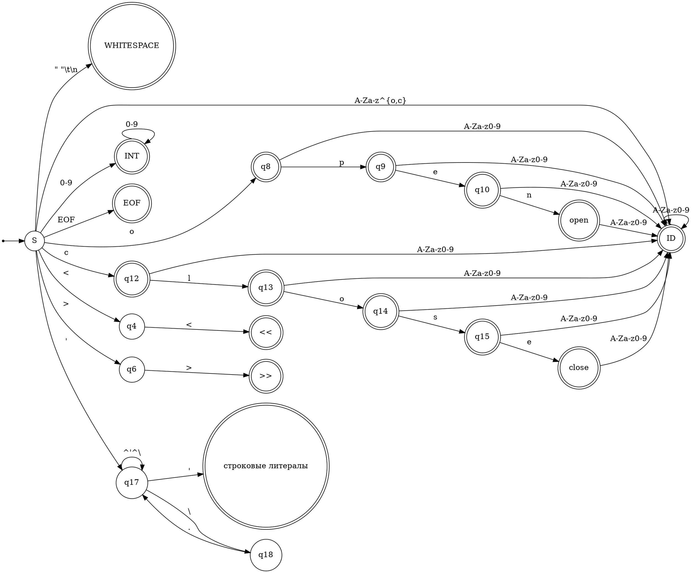

```
1) WHITESPACE : [ \t\n]+
2) ID         : [A-Za-z][A-Za-z0-9]*
3) INT        : [0-9]+
4) open       : open
   close      : close
5) <<         : <<
   >>         : >>
6) STRING     : ' ( (\'|[^'])* ) '
7) EOF        : EOF
```


