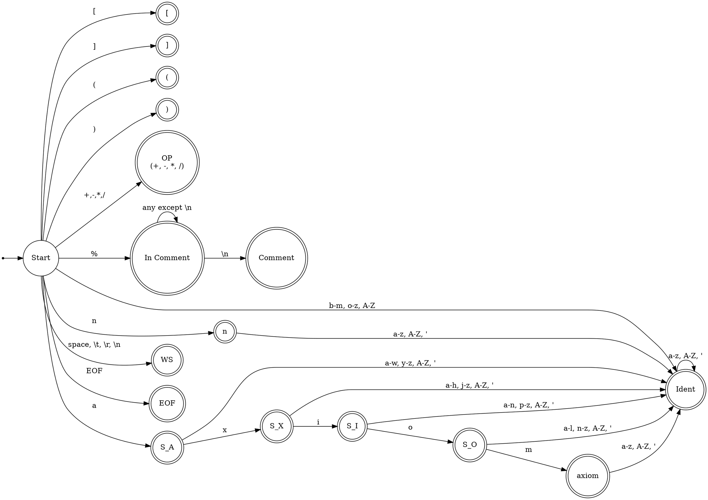

### 1. Описание лексической структуры и грамматики

#### 1.1 Лексическая структура

Входной язык состоит из следующих лексем (терминалов):

*   **Ключевые слова:** `axiom`, `n`
*   **Идентификаторы (`IDENT`):** Последовательности букв (латиница) и апострофов, начинающиеся с буквы (например, `E`, `T`, `E'`).
*   **Операторы (`OP`):** Символы `+`, `-`, `*`, `/`.
*   **Символы:** `[`, `]`, `(`, `)`.
*   **Комментарии (`COMMENT`):** Начинаются с символа `%` и продолжаются до конца строки. Комментарии игнорируются лексическим анализатором.
*   **Пробельные символы (`WS`/`SKIP`/`NEWLINE`):** Пробелы, символы табуляции, переводы строк (`\n`), возврат каретки (`\r`). Игнорируются анализатором, но служат разделителями лексем.
*   **Конец файла (`EOF`):** Специальная лексема, обозначающая конец входного потока.

#### 1.2 Грамматика (Формальное описание)

Грамматика входного языка, описывающая структуру файла определения грамматики:

```
PROG
    ::= (COMMENT | WS)*
        AXIOM
        (COMMENT | WS)*
        GRAMMAR
        (COMMENT | WS)*

COMMENT
    ::= '%' [^\n]* \n?       // от ‘%’ до конца строки (с опциональным \n)

WS
    ::= [ \t\r\n]+           // пробельные символы

AXIOM
    ::=  '['  'axiom'  '['  IDENT  ']'  ']' 

GRAMMAR
    ::= ( RULES )*

RULES
    ::=  '['  IDENT
               (  RULE )+    // одно или более правило
            ']' 

RULE
    ::=  '['  OP   IDENT  IDENT  ']'    // [ OP IDENT IDENT ]
      |  '['  IDENT  IDENT            ']'    // [ IDENT IDENT ]
      |  '['       ']'                             // [ ]
      |  '['       'n'              ']'        // [n]
      |  '['  '('  IDENT  ')'     ']'    // [( IDENT )]

OP
    ::= '+' | '-' | '*' | '/'

IDENT
    ::= [A-Za-z][A-Za-z']*
```

#### 1.3 Грамматика (Неформальное описание)

Входной файл описывает контекстно-свободную грамматику. Он должен содержать:
1.  Определение **аксиомы** (стартового символа) вида `[axiom [ИМЯ_СИМВОЛА]]`.
2.  Ноль или более определений **правил грамматики**. Каждое определение правил для одного нетерминала имеет вид `[ИМЯ_НЕТЕРМИНАЛА правило1 правило2 ...]`.
3.  Каждое **правило** (продукция) также заключается в квадратные скобки `[...]` и может иметь одну из следующих форм:
    *   Оператор и два идентификатора: `[OP IDENT IDENT]`
    *   Два идентификатора: `[IDENT IDENT]`
    *   Пустое правило (эпсилон): `[]`
    *   Ключевое слово `n`: `[n]`
    *   Идентификатор в круглых скобках: `[( IDENT )]`
Файл может содержать комментарии (от `%` до конца строки) и пробельные символы, которые игнорируются при синтаксическом разборе.

### 2. Разработка лексического анализатора




### 3. Таблица предсказывающего разбора


| Нетерминал (`A`) ↓ / Терминал (`t`) → | `[`                                      | `]`        | `axiom` | `IDENT` | `OP`¹ | `n` | `(` | `)` | `EOF` |
| :------------------------------------ | :--------------------------------------- | :--------- | :------ | :------ | :---- | :-- | :-- | :-- | :---- |
| **PROG**                              | `-> AXIOM GRAMMAR`                       |            |         |         |       |     |     |     |       |
| **AXIOM**                             | `-> [ axiom [ IDENT ] ]`                 |            |         |         |       |     |     |     |       |
| **GRAMMAR**                           | `-> RULES GRAMMAR`                       |            |         |         |       |     |     |     | `-> ε` |
| **RULES**                             | `-> [ IDENT RULE RULE_TAIL ]`            |            |         |         |       |     |     |     |       |
| **RULE**                              | *См. Особое правило ниже*²             |            |         |         |       |     |     |     |       |
| **RULE\_TAIL**                        | `-> RULE RULE_TAIL`                      | `-> ε`     |         |         |       |     |     |     |       |

1.  `OP` представляет любой из терминалов `+`, `-`, `*`, `/`.
2.  **Особое правило для `M[RULE, LBRACK]`:**
    *   Сопоставить и потребить терминал `[`.
    *   Посмотреть на следующий токен `t_next`.
    *   **Если `t_next` == `OP`:** Применить `RULE -> [ OP IDENT IDENT ]` (вернее, поместить `RBRACK, IDENT, IDENT, OP` в стек).
    *   **Если `t_next` == `IDENT`:** Применить `RULE -> [ IDENT IDENT ]` (поместить `RBRACK, IDENT, IDENT` в стек).
    *   **Если `t_next` == `RBRACK`:** Применить `RULE -> [ ]` (поместить `RBRACK` в стек, добавить узел `ε`).
    *   **Если `t_next` == `KW_N`:** Применить `RULE -> [ n ]` (поместить `RBRACK, KW_N` в стек).
    *   **Если `t_next` == `LPAREN`:** Применить `RULE -> [ ( IDENT ) ]` (поместить `RBRACK, RPAREN, IDENT, LPAREN` в стек).
    *   **Иначе:** Синтаксическая ошибка.


